# togethr-app
togethr is a platform for students and developers to form trusted hackathon teams, collaborate on projects, and showcase their skills.

### 🔗 **Live Demo:** https://togethr-psi.vercel.app/  
### 📦 **GitHub Repo:** https://github.com/caPt-tanmAY11/togethr-app

<br/>

## 🎯 Project Purpose

togethr was built as a portfolio and learning project to solve a real problem faced by students and developers:  

- Difficulty in finding genuine teammates
- Lack of trust in online collaboration
- Too much noise and spam on existing platforms

This project focuses on real collaboration, trust, and clean UX, while also showcasing full-stack development skills.

<br/>

## 🚀 Features

### 👥 Team Formation & Collaboration
- Create hackathon teams with clear goals, skills, and available slots
- Post real project ideas (short-term or long-term)
- Request to join teams instead of random DMs
- Team leads approve or reject requests
- Collaborate beyond hackathons on real projects


### 🧠 Trust-Based System
- Trust points earned through real participation
- Accepted join requests and collaborations increase trust
- Helps surface serious and reliable builders


### 🧑‍💻 Developer Profiles
- Clean, developer-first public profiles
- Showcase skills, projects, achievements, and links
- Profiles grow organically through real activity


### 🔐 Authentication & Security
- Email & password authentication
- Email verification and password reset
- Google and GitHub OAuth
- Secure session and access handling

<br/>

## 🛠️ Tech Stack

<div align="center">

| Category | Technologies |
|----------|-------------|
| **Frontend** |      |
| **Backend** |   |
| **Database** |   |
| **Auth** |    |
| **Data Fetching** |  |
| **Media** |  |
| **Deployment** |  |

</div>

<br/>

## 📂 Project Structure

```bash
togethr-app/
├── app/ # App Router pages & layouts
├── components/ # Reusable UI components
├── hooks/ # Custom hooks
├── lib/ # Utility & helper functions
├── prisma/ # Prisma schema & client
├── public/ # Static assets
```

<br/>

## 🧠 Platform Flow

```mermaid 
graph LR

    A[🔐 Authenticated User] --> B[👥 Join / Create Team]
    B --> C[🤝 Collaborate on Projects]
    C --> D[⭐ Earn Trust]
    D --> E[🚀 Strong Profile]
```

<div align="center">
  

</div>


## ⚙️ Getting Started (Local Setup)

### 1) Clone the repository:
```bash
git clone https://github.com/caPt-tanmAY11/togethr-app.git
cd togethr-app
```

### 2) Install project dependencies:
```bash
npm install
```

### 3) Setup environment variables:
```bash
# Database (Neon PostgreSQL)
DATABASE_URL=

# App URLs
APP_URL=
NEXT_PUBLIC_APP_URL=

# Better Auth (should match your app URL)
BETTER_AUTH_SECRET=
BETTER_AUTH_URL=

# Google OAuth
GOOGLE_CLIENT_ID=
GOOGLE_CLIENT_SECRET=

# GitHub OAuth
GITHUB_CLIENT_ID=
GITHUB_CLIENT_SECRET=

# Nodemailer (Gmail)
GMAIL_PASS=
GMAIL_USER=

# Cloudinary
CLOUDINARY_CLOUD_NAME=
CLOUDINARY_API_KEY=
CLOUDINARY_API_SECRET=

# Admin
ADMIN_EMAIL=
NEXT_PUBLIC_ADMIN_EMAIL=

```

### 4) Prisma setup:
```bash
npx prisma generate
npx prisma migrate dev
```
> This will generate the Prisma client and apply database migrations.

### 5) Start the development server:
```bash
npm run dev
```

### 6) Open the app:
Visit -> http://localhost:3000

<br/>

## 📸 Screenshots

### Landing Page


### Hack Teams Page


### Create Hack Team Page


### Projects Page


### Create Project Page


### Profile Page


<br/>

## 🤝 Contributions

This is a personal showcase project.  
Feedback, suggestions, and improvements are always welcome.

## 📄 License

This project is intended for educational and showcase purposes only.

## 👨‍💻 Author

<div align="center"> <table> <tr> <td align="center">  <br/> <b>Tanmay Vishwakarma</b> <br/> <sub>Full-Stack Developer</sub> <br/><br/> <a href="https://github.com/caPt-tanmAY11">  </a> </td> </tr> </table> </div>
